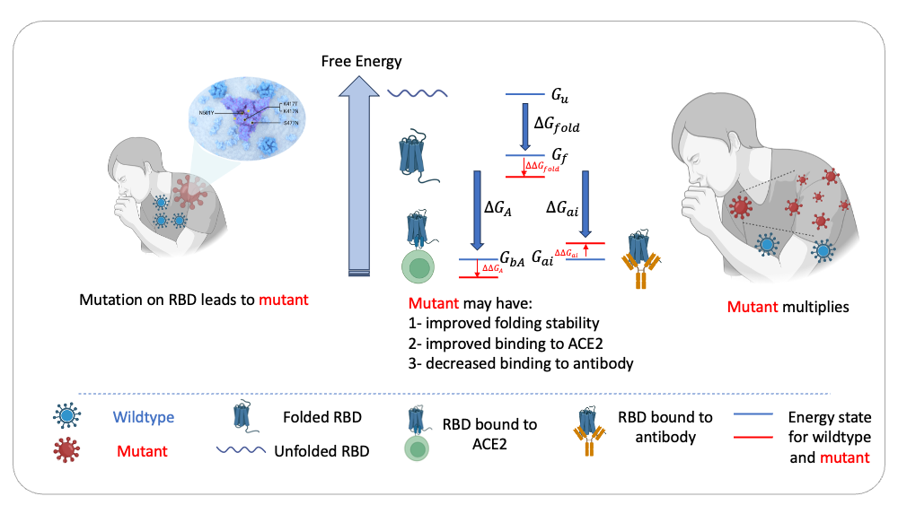

# Biophysical Model to Estimate SARS-CoV-2 RBD Fitness



Supporting material for the paper ["Biophysical principles predict fitness of SARS-CoV-2 variants"](https://www.biorxiv.org/content/10.1101/2023.07.23.549087v3) ([bioRxiv](https://www.biorxiv.org/content/10.1101/2023.07.23.549087v3)). Figures and supplementary data for that paper are in the [paper/](paper/) directory.


Plots and tables are generated by running various notebooks:
- [main_logistic.ipynb](main/main_logistic.ipynb):Notebook to generate figure 2, fitting the biophysical model using population fitness and experimental measured $K_D$.
- [main_ML.ipynb](main/main_ML.ipynb):Notebook to generate figure 3, using ML-predicted $K_D$ to estimate RBD fitness. To run the code, please download the ESM embedings from (https://zenodo.org/records/11267983)
- [main_epistasis.ipynb](main/main_epistasis.ipynb):Notebook to generate figure 4, investigating epistasis within the fitness landscape fitted by the biophysical model.
- [main_logistic_time.ipynb](main/main_logistic_time.ipynb):Notebook to generate the rolling window fitness comparison in figure 3. 


If you use this software or predictions in the [paper](paper/) directory please consider citing:

```
@article {Wang2023.07.23.549087,
	author = {Wang, Dianzhuo and Huot, Marian and Mohanty, Vaibhav and Shakhnovich, Eugene I.},
	title = {Biophysical principles predict fitness of SARS-CoV-2 variants},
	elocation-id = {2023.07.23.549087},
	year = {2024},
	doi = {10.1101/2023.07.23.549087},
	publisher = {Cold Spring Harbor Laboratory}}